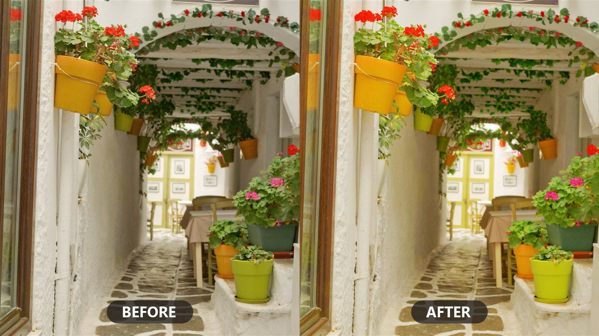

# Connect your AI to Affinity Photo

**Affinity Photo v3 has a built-in MCP server.** That means an AI agent — Claude Code, Codex,
Antigravity, OpenCode — can write and run real scripts inside the app: adjustment layers, filters,
batch work, all through Affinity's own JavaScript SDK. No extra software, no UI automation, no
macOS requirement.

This repo exists so **your agent can set that connection up for you.** Point it here and it will
find the config for whichever harness it's running in, plus the handful of non-obvious traps that
otherwise cost an afternoon.

## Just ask your AI

Open Affinity Photo, enable `Edit ▸ Settings ▸ Model Context Protocol ▸ Enable Affinity MCP`,
then paste this into your agent:

> Set up a connection to Affinity Photo's MCP server on Windows.
>
> Follow `github.com/bolloplayer/affinity-photo-claude-code-windows` — read its `SETUP.md` and do
> what it says for the harness you're running in, including the verification sequence at the end.
>
> If something fails, use `SETUP.md`'s troubleshooting section. Don't invent a workaround it
> doesn't describe — if you're stuck, stop and tell me what you tried and where `SETUP.md` stopped
> matching what you found.

That's it. Your agent reads **[`SETUP.md`](SETUP.md)**, registers the connection, proves it works
without touching anything of yours — then offers you a short menu: leave it there, run a
colour-boost on your open photo and see the before/after, write a look of your own, or make the
connection machine-wide.

> ### ⚠️ Expect one restart — it is not a failure
>
> Partway through, your agent will **stop and ask you to restart it**. That is supposed to happen.
>
> Every one of these tools loads its MCP configuration **once, at startup**. The agent has just
> written that configuration, so the connection cannot exist in the session that created it —
> there is no command that loads it live, in any of them.
>
> Quit, start it again in the same folder, approve the `affinity` server if prompted, and say
> **"continue"**. Your agent leaves itself a note, so the new session picks up where it stopped
> and goes straight to the before/after.
>
> **It is once for this folder.** And once you've seen it working, your agent offers to register
> Affinity machine-wide, so you never do the setup again in any project.

Prefer to do it by hand? `SETUP.md` reads perfectly well as a human document too.

## The connection, in one line

The endpoint is always:

```
http://[::1]:6767/sse
```

| Harness | Config file | Transport |
|---|---|---|
| **Claude Code** — CLI, VS Code, Desktop Code tab | `.mcp.json` in the project | SSE native |
| **Codex** — CLI, ChatGPT Codex tab | `~/.codex/config.toml` | stdio [bridge](bridge/) → SSE |
| **Antigravity** (`agy`) — Gemini | `.agents/mcp_config.json` (`serverUrl`) | SSE native |
| **OpenCode** — any model | `opencode.jsonc` or one CLI command | SSE native |

Three things that look like bugs and aren't: it's **`[::1]`, never `localhost` or `127.0.0.1`**
(Affinity binds IPv6 loopback only); it's **SSE only** (there is no Streamable HTTP endpoint); and
Affinity accepts **MCP protocol `2025-11-25`** alone, which is why Codex needs a bridge.
[`SETUP.md`](SETUP.md) has the full list and the reasoning.

## What's here

| | |
|---|---|
| **[`SETUP.md`](SETUP.md)** | The instruction sheet — per-harness config, the rules not to "fix", the verification sequence, troubleshooting |
| **[`examples/`](examples/)** | A read-only connection check, and a two-layer **Color Boost** you can run on any photo |
| **[`bridge/`](bridge/)** | The Codex protocol bridge, plus its smoke test |
| **[`verify.ps1`](verify.ps1)** | Checks the plumbing before you start — Affinity running, port listening, handshake |
| **[`CLAUDE.md`](CLAUDE.md)** | Connection internals, so Claude can diagnose problems from inside the chat |
| **[`docs/sdk-notes.md`](docs/sdk-notes.md)** | Confirmed SDK behaviours and mapped dead-ends |

## The tutorial

For a human walkthrough with screenshots — the Claude Code path end to end, and how to point
Claude Code at **DeepSeek** instead without changing a single config file:

**→ [bolloplayer.github.io/affinity-photo-claude-code-windows](https://bolloplayer.github.io/affinity-photo-claude-code-windows/)**

And if you haven't picked a model or a harness yet,
[`docs/choosing-your-ai.md`](docs/choosing-your-ai.md) compares them — what's verified, what's
assumed, and what each one costs.



## Status

Verified on Windows 11 with Affinity Photo 3.2.x: Claude Code (CLI and VS Code), Codex CLI and the
ChatGPT Codex tab, Antigravity, and OpenCode all connect, read the SDK preamble, and execute
scripts. Affinity exposes the same server on macOS, but only Windows is verified here.

Affinity's AI Connector is a free beta and Canva-owned; its APIs and the scripting SDK may change
without notice.

## License

MIT — see [`LICENSE`](LICENSE). Built against Affinity Photo's built-in MCP server (Affinity /
Canva). Independent project, not affiliated with or endorsed by Canva or Affinity.
